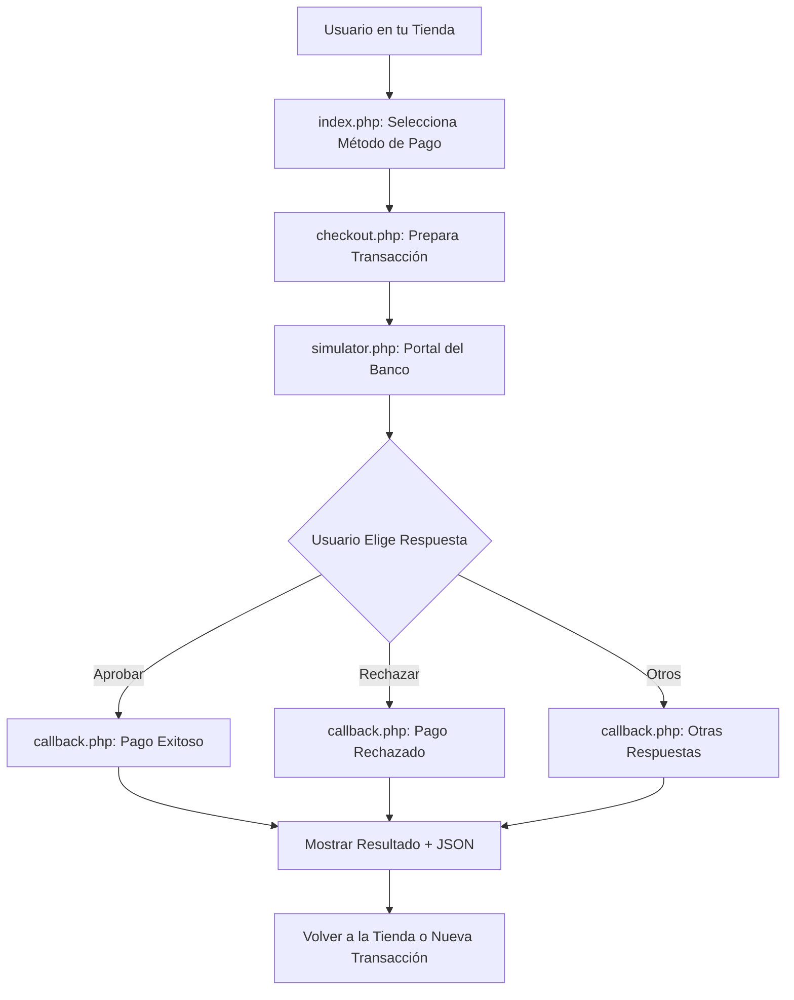

# 💳 Simulador Bancario - Payment Gateway Simulator

[](https://php.net)
[](https://getbootstrap.com)
[](LICENSE)

Un simulador completo de pasarelas de pago bancarias para desarrollo y testing. Replica el comportamiento exacto de **Webpay**, **Mercado Pago**, **PayPal** y transferencias bancarias sin necesidad de contratar los servicios reales.

---

## 📋 Tabla de Contenidos

- [Características](#-características)
- [Medios de Pago Soportados](#-medios-de-pago-soportados)
- [Requisitos](#-requisitos)
- [Instalación](#-instalación)
- [Configuración](#-configuración)
- [Uso del Simulador](#-uso-del-simulador)
- [Estructura del Proyecto](#-estructura-del-proyecto)
- [Flujo de Funcionamiento](#-flujo-de-funcionamiento)
- [Respuestas Simuladas](#-respuestas-simuladas)
- [Integración en tu Proyecto](#-integración-en-tu-proyecto)
- [API y Datos de Respuesta](#-api-y-datos-de-respuesta)
- [Ejemplos de Código](#-ejemplos-de-código)
- [Preguntas Frecuentes](#-preguntas-frecuentes)
- [Contribuir](#-contribuir)
- [Licencia](#-licencia)

---

## ✨ Características

✅ **Simulación realista** de flujos de pago completos  
✅ **Múltiples métodos de pago**: Webpay, Mercado Pago, PayPal, Transferencias  
✅ **Respuestas exactas** como las APIs reales (JSON, códigos de estado, etc.)  
✅ **6 escenarios de prueba**: Aprobado, Rechazado, Pendiente, Cancelado, Error, Timeout  
✅ **Interfaz profesional** con Bootstrap 5.3  
✅ **Sin base de datos** - Todo en sesiones (fácil de implementar)  
✅ **Autocontenido** - No requiere dependencias externas  
✅ **Documentación completa** - Comentarios en código y README detallado  
✅ **Responsive** - Funciona en móviles y desktop  
✅ **Open Source** - Código libre para usar y modificar  

---

## 💰 Medios de Pago Soportados

| Método | Proveedor | País | Estado |
|--------|-----------|------|--------|
| **Webpay Plus** | Transbank | 🇨🇱 Chile | ✅ Completo |
| **Mercado Pago** | Mercado Libre | 🌎 LATAM | ✅ Completo |
| **PayPal** | PayPal | 🌍 Global | ✅ Completo |
| **Transferencia Bancaria** | Genérico | 🇨🇱 Chile | ✅ Completo |

---

## 🔧 Requisitos

- **PHP**: 7.4 o superior
- **Servidor Web**: Apache, Nginx o servidor de desarrollo PHP
- **Extensiones PHP**:
  - `session` (habilitada por defecto)
  - `json` (habilitada por defecto)
- **Navegador**: Cualquier navegador moderno (Chrome, Firefox, Safari, Edge)

**No requiere:**
- ❌ Base de datos
- ❌ Composer
- ❌ Node.js
- ❌ Credenciales de APIs reales

---

## 📥 Instalación

### Opción 1: XAMPP / WAMP / MAMP (Recomendado para principiantes)

1. **Descarga el proyecto**
   ```bash
   git clone https://github.com/tu-usuario/bank_simulator.git
   ```
   O descarga el ZIP y extrae en tu carpeta de proyectos.

2. **Coloca el proyecto en tu servidor local**
   ```
   # XAMPP (Windows/Mac/Linux)
   C:\xampp\htdocs\bank_simulator\
   
   # WAMP (Windows)
   C:\wamp64\www\bank_simulator\
   
   # MAMP (Mac)
   /Applications/MAMP/htdocs/bank_simulator/
   ```

3. **Inicia tu servidor**
   - Abre el panel de control de XAMPP/WAMP/MAMP
   - Inicia Apache
   - No necesitas MySQL para este proyecto

4. **Accede al simulador**
   ```
   http://localhost/bank_simulator/
   ```

### Opción 2: Servidor PHP Built-in

1. **Navega al directorio del proyecto**
   ```bash
   cd bank_simulator
   ```

2. **Inicia el servidor PHP**
   ```bash
   php -S localhost:8000
   ```

3. **Accede al simulador**
   ```
   http://localhost:8000
   ```

---

## ⚙️ Configuración

El simulador está **pre-configurado** y funciona sin necesidad de configuración adicional. Sin embargo, puedes personalizar:

### 1. URL de Retorno (Callback URL)

Edita [checkout.php](checkout.php#L35) línea 35:

```php
'return_url' => 'http://localhost/bank_simulator/callback.php',
```

Cambia `localhost` por tu dominio en producción:
```php
'return_url' => 'https://tudominio.com/bank_simulator/callback.php',
```

### 2. Datos del Comercio

Edita [index.php](index.php#L66) para cambiar el monto o descripción:

```php
<input type="hidden" name="amount" value="49990">
<input type="hidden" name="description" value="Tu producto aquí">
```

### 3. Estilos Personalizados

Edita [css/bank-style.css](css/bank-style.css) para personalizar colores y diseño.

---

## 🚀 Uso del Simulador

### Paso 1: Selecciona el Método de Pago

1. Abre `http://localhost/bank_simulator/`
2. Verás un formulario con 4 métodos de pago:
   - Webpay Plus (Transbank)
   - Mercado Pago
   - PayPal
   - Transferencia Bancaria
3. Selecciona el método que quieres probar
4. Haz clic en **"Proceder al Pago Seguro"**

### Paso 2: Página de Redireccionamiento

- Verás una página de carga que simula la redirección al banco
- Se envían automáticamente los parámetros del método seleccionado
- Serás redirigido al portal del banco simulado

### Paso 3: Portal Bancario (Simulador)

En esta pantalla verás:
- **Resumen del pago**: Monto, orden, token
- **6 opciones de respuesta**:
  1. ✅ **Pago Aprobado**: Transacción exitosa
  2. ❌ **Pago Rechazado**: Fondos insuficientes o tarjeta rechazada
  3. ⏳ **Pago Pendiente**: En revisión o procesamiento
  4. ◀️ **Usuario Canceló**: Abandonó el proceso
  5. ⚠️ **Error del Sistema**: Error técnico
  6. ⏰ **Timeout**: Sesión expirada

### Paso 4: Resultado de la Transacción

Después de seleccionar una opción, verás:

- **Estado del pago** con color correspondiente
- **Detalles de la transacción**: ID, código de autorización, fecha
- **Respuesta JSON completa**: Tal como la recibirías en producción
- **Opciones**:
  - Volver a la tienda
  - Imprimir comprobante
  - Ver información de webhook

---

## 📁 Estructura del Proyecto

```
bank_simulator/
│
├── index.php                 # Página principal - Selector de medios de pago
├── checkout.php              # Prepara transacción y redirige al banco
├── simulator.php             # Portal del banco - Opciones de prueba
├── callback.php              # Procesa respuesta y muestra resultado
│
├── css/
│   └── bank-style.css        # Estilos personalizados
│
├── includes/
│   └── sessions.php          # Funciones auxiliares y utilidades
│
├── LICENSE                   # Licencia MIT
└── README.md                 # Este archivo
```

### Descripción de Archivos

#### 📄 `index.php`
- Página principal del simulador
- Muestra selector de métodos de pago
- Simula un e-commerce básico
- Incluye información del producto y monto

#### 📄 `checkout.php`
- Recibe datos del formulario de pago
- Genera transacción con ID único
- Prepara parámetros específicos por método
- Redirige automáticamente al simulador

#### 📄 `simulator.php`
- Interfaz del banco/pasarela
- Muestra resumen de la transacción
- Permite elegir tipo de respuesta
- Simula el portal real de cada proveedor

#### 📄 `callback.php`
- Procesa la respuesta del "banco"
- Genera datos de transacción realistas
- Muestra resultado al usuario
- Incluye JSON completo para desarrollo

#### 📄 `includes/sessions.php`
- Funciones auxiliares reutilizables
- Validaciones de datos
- Generación de tokens
- Formateo de montos
- Logging (opcional)

---

## 🔄 Flujo de Funcionamiento



### Flujo Detallado

1. **Usuario inicia pago** en `index.php`
   - Selecciona método de pago
   - Envía formulario POST a `checkout.php`

2. **Sistema prepara transacción** en `checkout.php`
   - Genera ID de transacción único
   - Crea token de seguridad
   - Guarda datos en sesión PHP
   - Prepara parámetros específicos del método
   - Redirige automáticamente a `simulator.php`

3. **Banco muestra interfaz** en `simulator.php`
   - Captura datos de la transacción
   - Muestra resumen del pago
   - Presenta 6 opciones de respuesta
   - Espera acción del desarrollador

4. **Usuario elige respuesta**
   - Hace clic en una de las opciones
   - Envía POST a `callback.php` con tipo de respuesta

5. **Sistema procesa respuesta** en `callback.php`
   - Recupera datos de sesión
   - Genera respuesta según tipo elegido
   - Crea JSON completo (como API real)
   - Muestra resultado al usuario

6. **Usuario ve resultado**
   - Visualiza estado del pago
   - Ve detalles de transacción
   - Puede copiar JSON para desarrollo
   - Opción de volver o imprimir

---

## 📊 Respuestas Simuladas

### 1. ✅ Pago Aprobado (approved)

**Cuándo usar**: Para probar flujo exitoso de pago.

**Respuesta Webpay**:
```json
{
  "status": "AUTHORIZED",
  "response_code": 0,
  "authorization_code": "123456",
  "vci": "TSY",
  "amount": 49990,
  "card_detail": {
    "card_number": "****1234"
  }
}
```

**Respuesta Mercado Pago**:
```json
{
  "id": 1234567890,
  "status": "approved",
  "status_detail": "accredited",
  "payment_method_id": "visa",
  "transaction_amount": 49990,
  "authorization_code": "123456"
}
```

### 2. ❌ Pago Rechazado (rejected)

**Cuándo usar**: Para probar manejo de errores de fondos insuficientes.

**Códigos de respuesta**:
- Webpay: `response_code: -1`
- Mercado Pago: `status_detail: cc_rejected_insufficient_amount`
- PayPal: `state: failed`

### 3. ⏳ Pago Pendiente (pending)

**Cuándo usar**: Para pagos que requieren confirmación manual.

**Casos de uso**:
- Transferencias bancarias
- Pagos en efectivo
- Revisión de fraude

### 4. ◀️ Pago Cancelado (cancelled)

**Cuándo usar**: Usuario abandona el proceso.

**Casos de uso**:
- Botón "Volver" en el banco
- Cierra la ventana de pago
- Sesión expirada por inactividad

### 5. ⚠️ Error del Sistema (error)

**Cuándo usar**: Para probar manejo de errores técnicos.

**Casos de uso**:
- Error de conexión con banco
- Timeout de API
- Error interno del servidor

### 6. ⏰ Timeout

**Cuándo usar**: Sesión de pago expiró.

**Casos de uso**:
- Usuario tarda mucho en confirmar
- Sesión expira por seguridad
- Límite de tiempo excedido

---

## 🔌 Integración en tu Proyecto

### Paso 1: Copiar Archivos Necesarios

Copia estos archivos a tu proyecto:

```bash
tu-proyecto/
├── payment/
│   ├── checkout.php       # De este simulador
│   ├── callback.php       # De este simulador
│   └── includes/
│       └── sessions.php   # Funciones auxiliares
```

### Paso 2: Modificar tu Formulario de Pago

En tu carrito de compras o página de checkout:

```php
<form action="payment/checkout.php" method="POST">
    <input type="hidden" name="amount" value="<?php echo $total_carrito; ?>">
    <input type="hidden" name="order_id" value="<?php echo $orden_id; ?>">
    <input type="hidden" name="description" value="<?php echo $descripcion; ?>">
    
    <!-- Radio buttons o select para método de pago -->
    <select name="payment_method" required>
        <option value="webpay">Webpay Plus</option>
        <option value="mercadopago">Mercado Pago</option>
        <option value="paypal">PayPal</option>
    </select>
    
    <button type="submit">Pagar Ahora</button>
</form>
```

### Paso 3: Cambiar URLs en Producción

En `checkout.php`, cambia:

```php
// DESARROLLO (simulador)
$transactionUrl = 'http://localhost/bank_simulator/simulator.php';

// PRODUCCIÓN (API real)
$transactionUrl = 'https://webpay3gint.transbank.cl/webpayserver/initTransaction';
```

### Paso 4: Manejar Callback en tu Base de Datos

En `callback.php`, agrega tu lógica:

```php
// Después de recibir respuesta exitosa
if ($response['status'] === 'approved') {
    // Actualizar orden en base de datos
    $db->query("UPDATE orders SET status = 'paid' WHERE id = ?", [$orderId]);
    
    // Enviar email de confirmación
    enviarEmailConfirmacion($cliente_email, $orden_id);
    
    // Generar factura
    generarFactura($orden_id);
}
```

---

## 🔍 API y Datos de Respuesta

### Estructura General de Respuesta

Todos los métodos devuelven esta estructura en `$_SESSION['last_transaction']`:

```php
[
    'transaction_id' => 'TXN-ABC123',
    'authorization_code' => '123456',
    'payment_id' => 1234567890,
    'timestamp' => '2024-02-07 14:30:00',
    'payment_method' => 'webpay',
    'amount' => 49990,
    'currency' => 'CLP',
    'order_id' => 'ORD-123',
    'status' => 'approved',
    'status_detail' => 'accredited',
    'response_code' => '00',
    'response_data' => [ /* Datos específicos del proveedor */ ]
]
```

### Webpay (Transbank) - Campos Específicos

```php
'response_data' => [
    'vci' => 'TSY',                      // Visa Commerce Indicator
    'status' => 'AUTHORIZED',
    'buy_order' => 'ORD-123',
    'session_id' => 'sess_abc123',
    'card_detail' => [
        'card_number' => '****1234'
    ],
    'accounting_date' => '0207',
    'transaction_date' => '2024-02-07 14:30:00',
    'authorization_code' => '123456',
    'payment_type_code' => 'VN',        // Venta Normal
    'response_code' => 0,
    'installments_number' => 0
]
```

### Mercado Pago - Campos Específicos

```php
'response_data' => [
    'id' => 1234567890,
    'status' => 'approved',
    'status_detail' => 'accredited',
    'payment_method_id' => 'visa',
    'payment_type_id' => 'credit_card',
    'transaction_amount' => 49990,
    'currency_id' => 'CLP',
    'date_created' => '2024-02-07T14:30:00.000Z',
    'date_approved' => '2024-02-07T14:30:05.000Z',
    'authorization_code' => '123456',
    'external_reference' => 'ORD-123',
    'merchant_order_id' => 1234567,
    'payer' => [
        'id' => 123456,
        'email' => 'test_user@test.com',
        'identification' => [
            'type' => 'RUT',
            'number' => '11111111-1'
        ]
    ]
]
```

### PayPal - Campos Específicos

```php
'response_data' => [
    'id' => 'PAY-ABC123DEF456',
    'intent' => 'sale',
    'state' => 'approved',
    'cart' => 'ORD-123',
    'create_time' => '2024-02-07T14:30:00Z',
    'payer' => [
        'payment_method' => 'paypal',
        'status' => 'VERIFIED',
        'payer_info' => [
            'email' => 'test@example.com',
            'first_name' => 'Test',
            'last_name' => 'User',
            'payer_id' => 'PAYERID123456',
            'country_code' => 'CL'
        ]
    ],
    'transactions' => [[
        'amount' => [
            'total' => '55.54',
            'currency' => 'USD'
        ]
    ]]
]
```

---

## 💻 Ejemplos de Código

### Ejemplo 1: Validar Pago en tu Backend

```php
<?php
session_start();

// Recuperar última transacción
$transaction = $_SESSION['last_transaction'] ?? null;

if (!$transaction) {
    die('No hay transacción para procesar');
}

// Validar estado
if ($transaction['status'] === 'approved') {
    // PAGO EXITOSO
    echo "¡Pago aprobado!";
    echo "Código de autorización: " . $transaction['authorization_code'];
    
    // Aquí actualizarías tu base de datos
    // updateOrderStatus($transaction['order_id'], 'paid');
    
} else {
    // PAGO FALLIDO
    echo "Pago no aprobado: " . $transaction['status'];
    echo "Detalle: " . $transaction['status_detail'];
}
?>
```

### Ejemplo 2: Crear Webhook para Notificaciones

```php
<?php
/**
 * webhook.php - Recibe notificaciones del banco
 */

// Recibir datos POST
$json = file_get_contents('php://input');
$data = json_decode($json, true);

// Validar firma (en producción)
$firma = $_SERVER['HTTP_X_SIGNATURE'] ?? '';
if (!validarFirma($data, $firma)) {
    http_response_code(401);
    die('Firma inválida');
}

// Procesar según método
switch ($data['payment_method']) {
    case 'webpay':
        procesarWebpay($data);
        break;
    case 'mercadopago':
        procesarMercadoPago($data);
        break;
    case 'paypal':
        procesarPayPal($data);
        break;
}

// Responder OK
http_response_code(200);
echo json_encode(['status' => 'received']);

function procesarWebpay($data) {
    // Actualizar orden
    $orderId = $data['order_id'];
    $status = $data['status'];
    
    // Guardar en BD
    // $db->query("UPDATE orders SET status = ? WHERE id = ?", [$status, $orderId]);
    
    // Log
    error_log("Webpay: Orden $orderId -> $status");
}
?>
```

### Ejemplo 3: Función para Iniciar Pago

```php
<?php
/**
 * Inicia un pago con el simulador o API real
 */
function iniciarPago($monto, $ordenId, $metodoPago) {
    $esProduccion = false; // Cambiar a true en producción
    
    if ($esProduccion) {
        // Integración real con API
        return iniciarPagoReal($monto, $ordenId, $metodoPago);
    } else {
        // Usar simulador
        return [
            'url' => 'http://localhost/bank_simulator/checkout.php',
            'params' => [
                'amount' => $monto,
                'order_id' => $ordenId,
                'payment_method' => $metodoPago,
                'description' => 'Compra en Mi Tienda'
            ]
        ];
    }
}

// Uso
$pago = iniciarPago(49990, 'ORD-123', 'webpay');

// Redirigir usuario
?>
<form id="paymentForm" action="<?php echo $pago['url']; ?>" method="POST">
    <?php foreach ($pago['params'] as $key => $value): ?>
        <input type="hidden" name="<?php echo $key; ?>" value="<?php echo $value; ?>">
    <?php endforeach; ?>
</form>
<script>document.getElementById('paymentForm').submit();</script>
```

### Ejemplo 4: Consultar Estado de Transacción

```php
<?php
/**
 * Consulta el estado de una transacción
 */
function consultarEstadoTransaccion($transactionId) {
    // Buscar en sesión (en producción sería BD)
    $historial = $_SESSION['transacciones'] ?? [];
    
    foreach ($historial as $tx) {
        if ($tx['transaction_id'] === $transactionId) {
            return [
                'found' => true,
                'status' => $tx['status'],
                'amount' => $tx['amount'],
                'date' => $tx['timestamp'],
                'details' => $tx
            ];
        }
    }
    
    return ['found' => false];
}

// Uso
$resultado = consultarEstadoTransaccion('TXN-ABC123');

if ($resultado['found']) {
    echo "Estado: " . $resultado['status'];
} else {
    echo "Transacción no encontrada";
}
?>
```

---

## ❓ Preguntas Frecuentes

### ¿Cómo cambio del simulador a las APIs reales?

1. Contrata el servicio (Webpay, Mercado Pago, etc.)
2. Obtén tus credenciales (API Key, Secret, etc.)
3. Instala el SDK oficial del proveedor
4. Reemplaza las llamadas al simulador por llamadas a la API real
5. Mantén el simulador para testing

**Ejemplo con Webpay**:

```php
// ANTES (simulador)
$url = 'http://localhost/bank_simulator/simulator.php';

// DESPUÉS (producción)
use Transbank\Webpay\WebpayPlus\Transaction;
$transaction = new Transaction();
$response = $transaction->create($orderId, $sessionId, $amount, $returnUrl);
$url = $response->getUrl() . '?token_ws=' . $response->getToken();
```

### ¿Puedo usar este simulador en producción?

**No.** Este simulador es **solo para desarrollo y testing**. En producción debes usar las APIs reales de los proveedores de pago. El simulador no procesa pagos reales ni maneja dinero.

### ¿Necesito una base de datos?

No para el simulador. Usa sesiones PHP. Sin embargo, en tu aplicación real **sí necesitarás** una base de datos para:
- Guardar órdenes de compra
- Registrar transacciones
- Logs de pagos
- Datos de clientes

### ¿Cómo agrego otro método de pago?

1. Agrega opción en [index.php](index.php) (formulario)
2. Agrega `case` en [checkout.php](checkout.php) con parámetros del nuevo método
3. Agrega configuración en [simulator.php](simulator.php)
4. Agrega respuesta en [callback.php](callback.php)

**Ejemplo para Stripe**:

```php
// En checkout.php
case 'stripe':
    $params = [
        'payment_intent' => 'pi_' . $token,
        'client_secret' => 'pi_' . $token . '_secret',
        'amount' => $amount,
        'currency' => 'clp',
        'payment_method' => 'stripe'
    ];
    break;
```

### ¿Es seguro este simulador?

Para **desarrollo local sí**, para **producción NO**. 

**Seguridad en desarrollo**:
- ✅ Solo funciona en localhost
- ✅ No expone datos sensibles
- ✅ No almacena información permanente

**NO usar en producción porque**:
- ❌ No valida firmas criptográficas
- ❌ No usa HTTPS obligatorio
- ❌ Los datos se pueden manipular
- ❌ No cumple PCI-DSS

### ¿Puedo personalizar los mensajes y textos?

¡Claro! Todo el texto está en español y puedes modificarlo editando los archivos PHP. Por ejemplo:

```php
// En callback.php, busca el array $responses
'approved' => [
    'title' => 'Tu mensaje aquí',
    'message' => 'Tu descripción aquí',
    // ...
]
```

### ¿Funciona con WordPress / Laravel / React?

**Sí**, con adaptaciones:

- **WordPress**: Coloca en un plugin o tema, usa `$wpdb` en lugar de sesiones
- **Laravel**: Convierte a controladores, usa rutas y Eloquent
- **React/Vue**: Usa como backend API, consume con `fetch` o `axios`

### ¿Puedo agregar más monedas?

Sí, edita la función `convertirMoneda()` en [includes/sessions.php](includes/sessions.php):

```php
$tasas = [
    'CLP_USD' => 0.0011,
    'CLP_EUR' => 0.0010,
    'CLP_MXN' => 0.050,  // Agregar más monedas
];
```

---

## 🤝 Contribuir

¡Las contribuciones son bienvenidas! 

### Cómo contribuir:

1. Fork este repositorio
2. Crea una rama para tu feature (`git checkout -b feature/nueva-funcionalidad`)
3. Commit tus cambios (`git commit -m 'Agrega nueva funcionalidad'`)
4. Push a la rama (`git push origin feature/nueva-funcionalidad`)
5. Abre un Pull Request

### Ideas para contribuir:

- 🌍 Agregar más métodos de pago (Stripe, Khipu, Flow, etc.)
- 🎨 Mejorar diseño e interfaz
- 🌐 Traducir a otros idiomas
- 📝 Mejorar documentación
- 🐛 Reportar o arreglar bugs
- ✨ Agregar nuevas funcionalidades

---

## 📄 Licencia

Este proyecto está licenciado bajo la Licencia MIT - ver el archivo [LICENSE](LICENSE) para más detalles.

```
MIT License

Copyright (c) 2024 Bank Simulator

Permission is hereby granted, free of charge, to any person obtaining a copy
of this software and associated documentation files (the "Software"), to deal
in the Software without restriction...
```

---

## 🙏 Agradecimientos

- **Bootstrap 5.3**: Framework CSS utilizado
- **Bootstrap Icons**: Iconos del proyecto
- **Transbank**: Documentación de Webpay
- **Mercado Pago**: Documentación de API
- **PayPal**: Documentación de Developer

---

## 📞 Soporte

¿Necesitas ayuda?

- 📧 **Email**: soporte@ejemplo.com
- 💬 **Issues**: [GitHub Issues](https://github.com/tu-usuario/bank_simulator/issues)
- 📚 **Documentación**: Este README
- 💻 **Código**: Revisa los comentarios en los archivos PHP

---

## 🎯 Roadmap

### Versión 1.1 (Próximamente)
- [ ] Agregar Stripe
- [ ] Agregar Khipu (Chile)
- [ ] Agregar Flow (Chile)
- [ ] Base de datos opcional (SQLite)
- [ ] Panel de administración

### Versión 2.0 (Futuro)
- [ ] API REST completa
- [ ] Webhooks simulados
- [ ] Tests automatizados
- [ ] Docker container
- [ ] Logs avanzados

---

## 📊 Estadísticas del Proyecto

- **Archivos PHP**: 5
- **Líneas de código**: ~2,500
- **Métodos de pago**: 4
- **Escenarios de prueba**: 6
- **Sin dependencias externas**: ✅
- **100% funcional**: ✅

---

## 🌟 Star History

Si este proyecto te fue útil, ¡dale una ⭐ en GitHub!

---

**Desarrollado con ❤️ para la comunidad de desarrolladores**

---

## 📚 Enlaces Útiles

### Documentación Oficial de Proveedores

- [Transbank Developers](https://www.transbankdevelopers.cl/)
- [Mercado Pago Developers](https://www.mercadopago.cl/developers/)
- [PayPal Developer](https://developer.paypal.com/)
- [Stripe Documentation](https://stripe.com/docs)

### Recursos Adicionales

- [PCI DSS Compliance](https://www.pcisecuritystandards.org/)
- [PHP Manual - Sessions](https://www.php.net/manual/es/book.session.php)
- [Bootstrap 5.3 Docs](https://getbootstrap.com/docs/5.3/)

---

**Última actualización**: 7 de febrero de 2026  
**Versión**: 1.0.0  
**Autor**: Regline.cl 
**Licencia**: MIT
